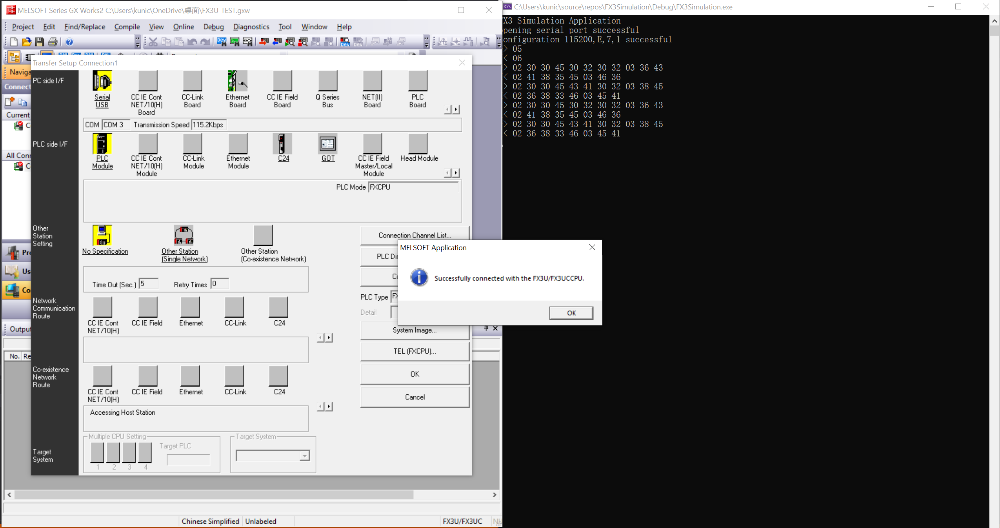

Simulation Mitsubish FX3U PLC Serial Communication(Programming Port)
===

the code for studying FX3U with Melsoft communcation.

running on Windows with [com0com](https://sourceforge.net/projects/com0com/).

Status
---
testing on Windows 10 x64 21H2 (19044.1645).

connection test passed

Screen shot
---

install [com0com](https://sourceforge.net/projects/com0com/)

Connection Test
---

[Another Testing Video clip on Youtube](https://youtu.be/r_XOcbTEAzA "Another testing")

Build tools
---
Visual Studio 2019
