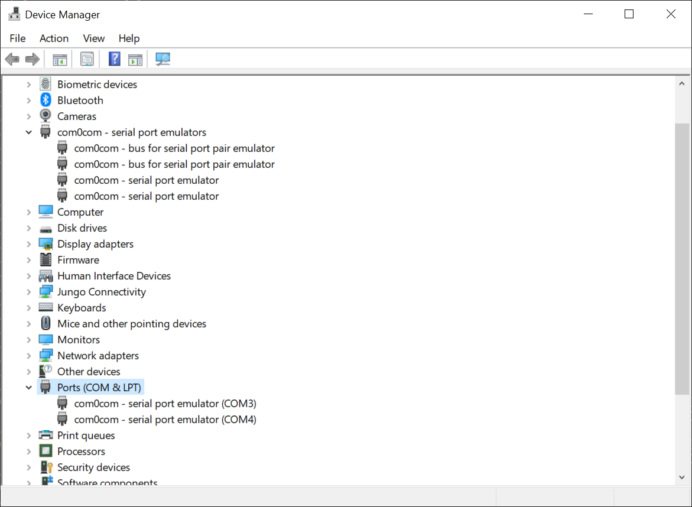

Simulation Mitsubish FX3U PLC Serial Communication(Programming Port)
===

the code for studying FX3U with Melsoft communcation.

running on Windows with [com0com](https://sourceforge.net/projects/com0com/).

---
Work setting
---

* COM3 for GX2 Works access
* COM4 for our FX3U simulation program (definition in code)

GX2 Work <<\==>> COM3 (com0com) << bind >> COM4 (com0com) <\==> FX3U simulation Program

if you need change COMPORT, search ***LINK_COMPORT*** in source code.

Status
---
testing on Windows 10 x64 21H2 (19044.1645).

connection test passed

Screen shot
---
install [com0com](https://sourceforge.net/projects/com0com/)

Connection Test
---

Another Testing
---

or

[Another Testing Video clip, play on Youtube](https://youtu.be/r_XOcbTEAzA "Another testing")

Build tools
---
Visual Studio 2019
